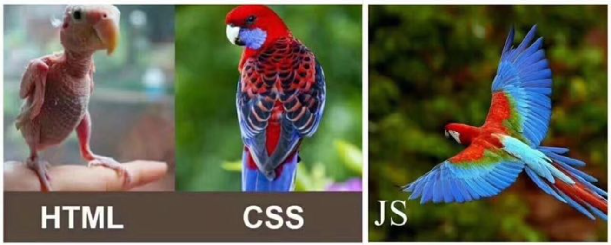
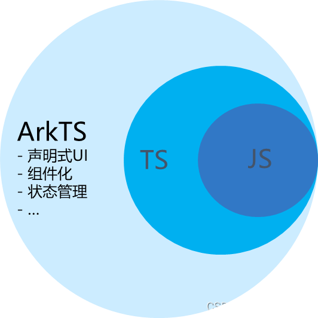

# day02_HTML标签

背景介绍 : 为啥我们学习鸿蒙生态系统开发, 还要学习HTML和CSS我们直接去开发对应的APP或者是对应的网站不就行了吗?  那可不是这样的, 我们所有的生态系统的无论是各种各样的APP, 各种各样的只能穿戴设备, 各种各样的网站系统等等,所有能展示给用户看的都离不开我们的HTML; HTML是众多开发语言中必不可少的一个组成部分; 如果想要搭建一个完整的网站HTML是重中之重; 

## 1. 今日目标

了解鸿蒙生态开发内容

安装开发工具

了解网站的组成部分

网站HTML相关内容

## 2. 鸿蒙生态网站开发入门

鸿蒙生态开发遵循的一个原则是 : 一次开发多端部署 , 一次开发多处使用 , 可以提高我们的开发效率; 再鸿蒙生态系统下我们的开发仍然是有以下几个模块: HarmonyOS PC端模块开发, HarmonyOS 移动端模块开发 , HarmonyOS 车载系统模块开发, HarmonyOS 智能穿戴模块开发  

HarmonyOS 开发应用场景 : 智能家居领域 , 智能医疗领域 , 智慧城市领域等等 ; 

## 3. 软件安装

作为一个HarmonyOS 系统开发的专业人员, 我们目前需要安装一下软件

### 1) 屏幕共享工具

1. 千锋屏幕共享 ( 2.0版本 ) 
2. 小绿屏幕共享工具

### 2) 图像测量工具

1. pxCook ( 像素大厨 )
2. ps软件 ( 高版本2018版本以上 , 如果不能安装,则安装低版本即可  )

### 3) 浏览器

1. 谷歌浏览器 ( https://www.google.cn/chrome/index.html )
2. 火狐浏览器 ( https://www.firefox.com.cn/ )

### 4) 编辑器

1. vscode ( https://code.visualstudio.com/ )
   1. VScode软件中的对应的插件
2. DevEco Studio  ( https://developer.huawei.com/consumer/cn/deveco-studio/ ) 但是我们最后一天使用的时候才会安装
   1. 安装注意事项后面会详细的为大家讲解

## 4. 网页的组成部分

1. 鸿蒙生态系统网站组成部分

   1. HTML篇 : HTML是生态系统网站开发的最基础部分 , 是我们网站的基础骨架

   2. CSS篇 : CSS是生态系统中对于HTML基础结构的修饰 , 是我们网站开发; 

   3. JS篇 : JavaScript是生态系统快开发中最基础的程序语言, 是动态交互语言

      

2. 鸿蒙生态中除了以上开发语言之外, 我们还会使用TypeScript , ArkTS

   三者语言之间的关系大致可以理解为:

   JavaScript是一种属于网络的高级脚本语言，已经被广泛用于Web应用开发，常用来为网页添加各式各样的动态功能，为用户提供更流畅美观的浏览效果。

   TypeScript 是 JavaScript 的一个超集，它扩展了 JavaScript 的语法，通过在JavaScript的基础上添加静态类型定义构建而成，是一个开源的编程语言。

   ArkTS兼容TypeScript语言，拓展了声明式UI、状态管理、并发任务等能力。

   由此可知，TypeScript是JavaScript的超集，ArkTS则是TypeScript的超集，

   

   

## 5. 网站HTML篇

无论是在什么生态中进行开发 , 我们必须必须学习的基础语言之一就是HTML结构语言. 

### 1) 站点的创建

站点的创建 ( 一个大的文件夹里面四个小的文件夹 : img文件夹 , css文件夹 , js文件夹 , html文件夹;  和一个小的页面文件: index.html文件 )

### 2) 快速创建页面结构

快捷键 : shift+!+tab

快捷键 : html:5

### 3) 结构注释语句

快捷键 : ctrl+?

### 4) 标签的含义

HTML标签, 也称之为元素, 也称之为记号. 三个名字都是同样的意思

### 5) 标签的基本语法

​	单标签

​		基本语法 : <标签名字   属性="属性值"   属性="属性值"   属性 ="属性值"> 

​	双标签

​		基本语法 : <标签名字   属性="属性值"   属性="属性值"   属性="属性值"></标签名字>

### 6) 标签的特点

 	1) 所有的标签都需要使用尖角号
 	2) 单标签只有开始没有结束, 双标签有开始有结束
 	3) 属性和属性值放在开始位置处
 	4) 属性和标签名字之间必须带空格
 	5) 属性和属性值之间使用等号链接
 	6) 属性值需要带引号
 	7) 每一组属性和属性值之间需要带空格
 	8) 标签可以带一个属性也可以带多个属性甚至一个都不带

### 7) 常见的单标签

#### 	1) 图像标签

```html
<!--
	图像标签 : 让一张图片显示在浏览器(PC浏览器, 手机浏览器)中,
	图像基本语法 :   image单词的简写
	路径属性 : 查找引入图片的一种途径
	相对路径 : 相对路径是通过文件和文件夹之间的关系来引入对应的图片文件
-->
```

#### 	2) 换行标签

```html
<!--
	换行标签 : 强制让文本进行折行显示; 
	基本语法 : <br>  break单词的简写 
-->
```

#### 	3) 水平线标签

```html
<!--
	水平线标签 : 一条从左通到右侧的线条, 进行上下区域分割
	基本语法 : <hr  noshade="阴影属性"  color="颜色属性" width="宽度属性"  align="水平对其方式" size="尺寸和高度">
	标签属性 : 
		1)noshade="noshade"  属性和属性值一致, 可以直接使用属性替换
		2)color="水平线颜色" 颜色单词
		3)width="宽度属性"  设置水平线宽度
		4)align="水平对其"  设置宽度之后, 默认从中间位置显示 取值left/right/center
		5)size="尺寸和高度"  用来替换height属性
-->
```

#### 	4) input输入框标签

```html
<!--
	含义 : input标签属于表单(form)中的控件, 控件内容其实有很多(输入框, 密码框, 单选框, 复选框, 下拉菜单, 文本域等等), 今天我们只需要了解两个即可, 输入框, 和密码框
	基本语法 : <input type="?">
	注意事项 : input标签要放在form标签里面使用
	1)输入框:单行文本输入框
		<input type="text">
	2)密码框:加密单行文本框
		<input type="password">
-->
```

### 5) 常见的双标签

#### 	1) 加粗标签

```html
<!--
	含义 : 对文本进行加粗显示
	基本语法 : <b>文本</b> <strong>文本</strong>
	对比 : 
		相同点:都能实现加粗
		不同点:后者更加具有语义化,和强调性; 前者只是让文本加粗
-->
```

#### 	2) 倾斜标签

```html
<!--
	含义 : 对文本进行倾斜显示
	基本语法 : <i>文本</i> <em>文本</em>
	对比 :
		相同点:都能实现加粗
		不同点:后者更加具有语义化,和强调性; 前者只是让文本添加倾斜效果
-->
```

#### 	3) 下划线标签

```html
<!--
	含义 : 为文本添加下划线修饰效果
	基本语法 : <u>文本</u> <ins>文本</ins>
	对比 : 
		相同点:都能实现下划线效果
		不同点:后者更加具有语义化,和强调性; 前者只是为文本添加下划线
-->
```

#### 	4) 删除线

```html
<!--
	含义 : 为文本添加一条删除线修饰效果
	基本语法 : <s>文本</s> <del>文本</del>
	对比 : 
		相同点:都能实现删除线效果
		不同点:后者更加具有语义化,和强调性; 前者只是为文本添加删除线
-->
```

#### 	5) 角标标签

```html
<!--
	含义 : 用来实现一些特殊场景的效果, 例如单位, 化学方程式, 论文带有角标,注释等效果; 角标分为:上角标和下角标
	基本语法: 
		上角标:<sup>文本/数字</sup>
		下角标:<sub>文本/数字</sub>
	案例 :
		H<sub>2</sub>O  m<sup>2</sup> 论文引用于[*******]<sup>①</sup>
-->
```

#### 	6) font标签

```html
<!--
	含义 : 文本的修饰标签, 主要用于对文本的颜色, 大小, 字体进行修饰; 但是实际开发的时候我们使用的频率还是比较低; 目前我们可以先使用font标签来实现简单的文本样式
	基本语法 : <font size="文本大小" color="文本颜色" face="文本字体">文本</font>
	标签属性 :
		1)size="文本的尺寸大小" 取值为数值, 取值为1-7 
		2)color="文本颜色" 取值为颜色单词,等其他的方法
		3)face="文本字体"  宋体, 隶书, 楷体等都能实现 但是需要考虑浏览器的支持, 有些字体浏览器不支持, 则需要浏览器自行安装
-->
```

#### 	7) div标签

```html
<!--
	含义 : div是一个比较大的盒子, 也可以称之为容器, 只不过这个容器比较大, 任何一个标签都可以称之为容器, 只不过是容器大小的问题
	基本语法 : <div></div>
	主要作用 : 用于区块划分, 默认是纵向显示; 后续开发过程中我们经常使用
	注意事项 : 双标签里面可以放置任何的标签
-->
```

#### 	8) p标签

```html
<!--
	含义 : 段落划分标签,文章的段落
	基本语法 : <p>文本/文本修饰标签</p>
	注意事项 : 里面只能放置文本/图片/文本修饰类型的标签 ;不能放置自己本身, 不能放置其他的区块划分标签
-->
```

