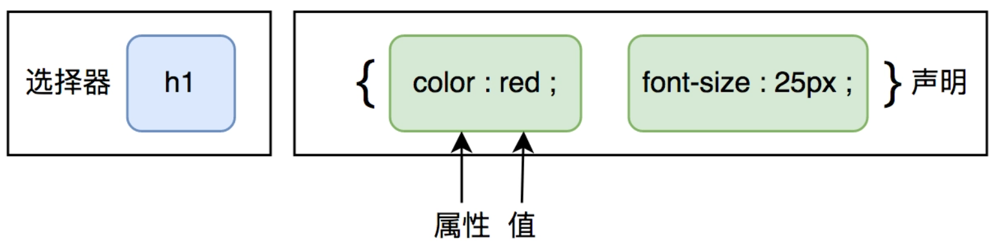

# day03_CSS基础

背景介绍 : HarmonyOS鸿蒙生态系统中HTML基础篇我们告一段落 , 今天我们逐渐步入到HarmonyOS中的CSS篇 ; CSS主要是对HarmonyOS系统中的结构进行美化 , 他就相当于我们的化妆师 , 能把我们打扮的漂漂亮亮的;  

## 1. 今日学习目标

1. 复习
2. CSS含义
3. CSS在鸿蒙生态中的作用
4. CSS基本语法
5. CSS基本语法使用位置
6. 选择器
7. 样式规则

## 2. CSS含义

CSS含义 : Cascading  Style  Sheet , 被称之为层叠样式表 

## 3. CSS在HarmonyOS中的作用

CSS作用 : 主要对于页面中HTML结构进行修饰 , 例如修饰的文本大小 , 文本加粗 , 文本颜色 , 背景颜色 等等  

## 4. CSS基本语法

学习任何一门语言我们首先要学习语言的基本语法 

### 1) CSS基本语法为:

```
选择器{ 
	属性:属性值;
	属性:属性值;
	属性:属性值
}

选择器 : 查找页面元素的方式方法
{} : 样式声明/样式规则 , 用来规定选择器查找到的元素实现何种样式
```



### 2) CSS基本语法特点:

1. 基本语法有两个部分组成 : 选择器和样式声明 ( 样式规则 ) ;
2. {}被称之为样式声明 , 声明中的属性和属性值使用冒号 ( : ) 链接 ; 
3. 每一组属性和属性值结束后需要使用分号 ( ; ) 进行分割 ;
4. 如果是最后一组属性和属性值 , 我们可以不用添加分号 , 但是我们推荐一定要进行添加 , 方便我们后续继续添加对应的修饰 ; 

### 3) CSS基本语法中的面试题 ( 力扣 )

​	面试题1 : CSS基本语法有几个部分组成

​		两个部分组成 : 选择器和样式声明 ( 样式规则 ) 

​	面试题2 : CSS样式声明有几个部分组成

​		两个部分组成 : 属性和属性值组成

## 5. CSS语言中的注释语句

​	快捷键 : ctrl+? 

​	语法 :  /* 注释语句 */

## 6. CSS语法使用位置

​	学习完基本语法 , 我们继续学习CSS语法的使用位置; 我们需要将对应的语法放在一个独立的以 .css 为后缀名的文件中; 

​	然后在html页面头部区域中 , 使用link标签, 然后将css文件进行引入

​	link标签的基本语法为

```html
<head>
	<link rel="stylesheet" href="CSS文件的路径">
</head>
```

## 7. CSS选择器

### 1) 选择器的含义

​	查找页面元素的方式方法 , 查找页面元素的方法有很多 , 接下来我们开始学习查找页面元素 .

### 2) 常见的选择器

#### 	1) 标签选择器

```html
<!--
	含义 : 标签选择器, 是将标签名字当做查找页面元素的方式, 只要有对应名字的标签, 无论嵌套级别多么深入都可以被匹配到. 任何一个标签名字都可以当做选择器
	基本语法 : p{样式声明}  div{样式声明}
	优缺点 : 
		优点:直接匹配
		缺点:匹配范围过于广泛, 精准度不够高, 不能达到精准匹配
-->
```

#### 	2) class类选择器

```html
<!--
	含义 : 使用class属性给元素起一个class类名, 然后再CSS文件中通过类名查找页面中的元素
	基本语法 : 
		起名: <div  class="box">
		查找: .box{样式规则}
	注意事项 :
		1)类名不能使用特殊符号, 不能使用中文, 不能以数字开头
		2)类名使用的时候点(.)不能省略
-->
```

#### 	3) 通配符选择器

```html
<!--
	含义 : 用来匹配页面中的所有元素, 或者是某一个区域中的所有元素
	基本语法 : 
		*{样式规则}  div>*{样式规则}
	注意事项 :
		1)*{}主要用来取消元素自带的内边距和外边距
-->
```

#### 	4) 子代选择器

```html
<!--
	含义 : 查找当前元素内所有符合条件的儿子辈分的元素
	基本语法 : 
		选择器1>选择器2{样式规则}
	注意事项 : 使用符号为(>)
-->
```

#### 	5) 伪类选择器

```html
<!--
	含义 : 元素本身没有对应的效果, 需要通过鼠标事件才能完成对应的效果
	基本语法 : 
		选择器:hover{样式规则}
		代表的是鼠标划过的时候出现的对应的样式
-->
```

### 3) 选择器的权重值

​	选择器的权重值相加

## 8. CSS样式规则

今天学习的样式规则为 : 

		1) 宽度规则 : width
		1) 高度规则 : height
		1) 背景颜色规则 : background-color规则

