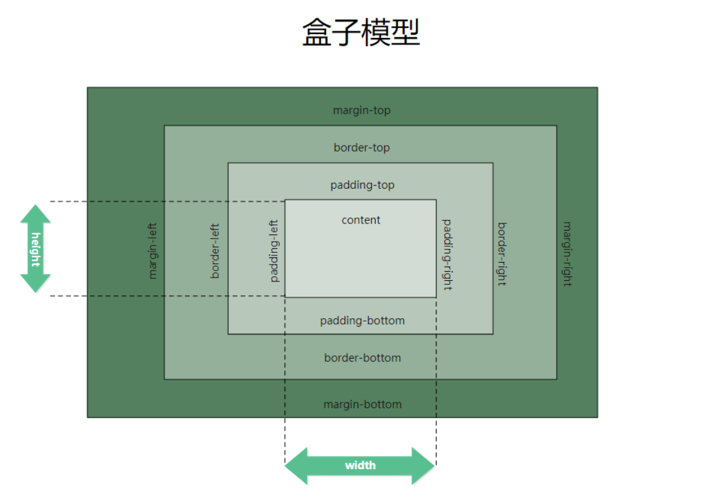
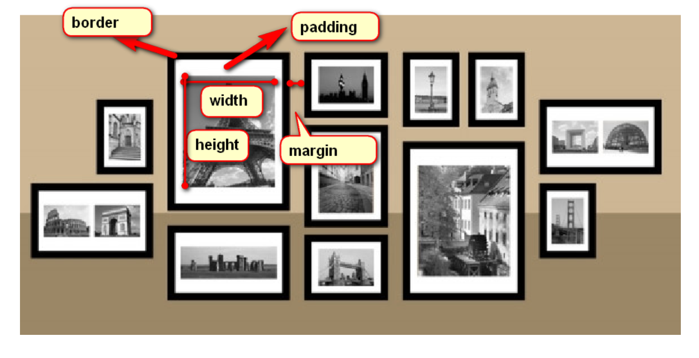

# day06_Harmony核心样式

背景 : HarmonyOS中无论是开发生态中的哪一款软件 ,  都需要使用核心样式进行调整 , 通过使用核心样式 , 来让我们的软件变得更加美观

## 今日学习目标

1. 盒子模型含义
2. 盒子模型-内边距
3. 盒子模型-外边距
4. 盒子模型-边框
5. 盒子模型应用

## 1. 盒子模型含义

### 1) 含义 : 

盒子即为容器 , 任何一个元素都可以称之为容器 , 只不过容器有大有小 , 区块划分的元素是比较大的容器 , 文本修饰的标签属于比较小容器 , 嵌套规则是大容器嵌套小容器 ( 简述 : 区块划分元素里面嵌套 )

### 2) 盒子模型组成部分 :

   四个部分组成的

1. 内容区域 : 宽度和高度

2. 内边距区域 : 

3. 边框距区域

4. 外边距区域

   

## 2. 内边距规则

### 1) 含义 : 

内边距指的是内容和和边框至今的距离, 也可以理解成边框里面的距离 

### 2) 属性 : 

​       padding-方向词

1. padding-top : 上内边距
2. padding-right : 右内边距
3. padding-bottom : 下内边距
4. padding-left : 左内边距

### 3) 内边距的应用

1. 案例1

2. 案例2

3. 案例3

   

## 3. 外边距规则

### 1) 含义 : 

外边距指的是元素与元素之间 , 边框与边框之间的距离

### 2) 属性 :  

​       margin-方向词

1. margin-top : 上外边距
2. margin-right : 右外边距
3. margin-bottom : 下外边距
4. margin-left : 左外边距

### 3) 外边框的应用

1. 案例1
2. 案例2
3. 案例3

## 4. 边框规则

### 1) 含义 : 

一个容器的边缘, 用来分隔内边距和外边距

### 2)属性 :

​       border-方向词

1. border-top:上边框
2. brder-right:右边框
3. border-bottom:下边框
4. border-left:左边框

### 3) 边框的使用

1. 边框的图形制作 : 三角形等