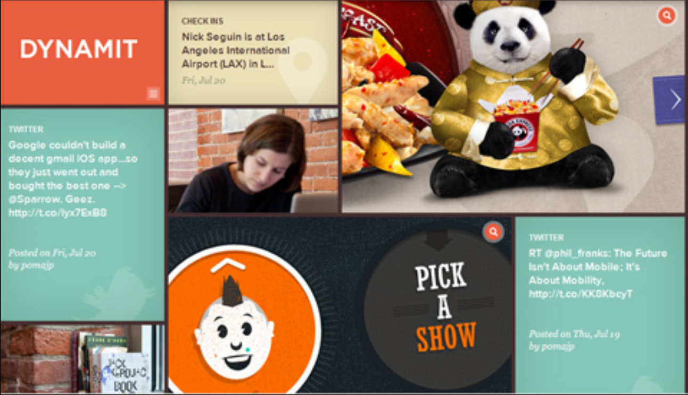

# day11_HarmonyOS生态中的Grid

**背景 :** 网格项目主要应用于大屏和触屏项目 , 例如HarmonyOS生态中的车载屏幕系统 , 所以在HarmonyOS生态中我们也需要完成车载系统的开发


## 今日学习目标

1. 网格的基础概念
2. 如何触发网格
3. 容器上面的属性
4. 项目中的属性
5. 项目案例

## 1. 网格的基础概念

### 1) 什么是网格

网格是一种新型的布局方式 , 主要是用来实现一些 , 比较复杂型的单元格合并布局 , 主要应用于一些大屏项目或者是车载项目的展示 

### 2) 网格与表格的区别

网格布局 : grid布局 , 也称之为网格布局 , 能简化表格的结构 , 同时还能实现划分行列单元格 , 简化布局; 

表格布局 : 属于正常布局范畴 , 划分行列属于二维布局中的一种 , 但是比较复杂 ( table>tr>td ) , 表格布局中最重要的最复杂的点 : 合并单元格 ;

### 3) 网格的应用场景

#### 	1) 系统窗口


#### 	2) 首屏项目




### 4) 网格中的概念

#### 	1) 网格 : 

​		类似于表格 , 主要应用于复杂的合并单元格场景 

#### 	2) 行和列

​		网格中的横向为行 , 网格中的纵向为列

​		

#### 	3) 网格线

​		 网格线是组成网格的重要区域 ,  

​		

#### 	4) 网格

​		网格是由横纵网格线组成的一个区域, 这个区域被称之为网格;

​		

#### 	5) 容器

​		容器就是我们所谓的父元素

#### 	6) 项目

​		项目就是我们的子元素

​		

## 2. 如何触发网格

触发网格的属性为 : 

```html
<style>
    /* 
    	触发的属性:display属性
    	取值:grid / inline-grid
    		grid : 块状网格
    		inline-grid : 行内块状网格
    */
    div{
        width:500px;
        height:500px;
        border:10px solid gray;
        display:grid/inline-grid
    }
</style>
<div></div>
```


## 3. 容器上面的属性

### 1) 触发网格

```html
<style>
	.box{
		width: 800px;
        height: 800px;
        border: 5px solid gray;
        /* 触发网格 */
        display: grid;
	}
</style>
<span>你好呀</span>
<span class="box">1</span>
<span>你好呀</span>
```

### 2) 划分行列


```html
<!--
	备注 : 这里没有放置子元素, 我们可以通过控制台 选中网格区域然后可以看到网格区域
	grid-template-rows: 划分行数
	grid-template-columns: 划分列数
		属性后面的取值代表了划分的行数和列数, 多个取值之间使用空格隔开
	取值类型
		1)纯数值
			rid-template-rows: 200px 200px 100px;
            grid-template-columns: 100px 100px 100px 100px;
		2)百分比数值
			grid-template-rows: 10% 10% 20% 10% ;
            grid-template-columns: 10% 10% 20% 20%;
		3)repeat()函数 
			解决取值重复的问题
			repeat(num1,num2)
                num1==重复的次数
                num2==宽度/高度
			grid-template-rows: repeat(5,100px) 50px;
            grid-template-columns: repeat(4,50px);
		4)占剩余宽度的所有: auto
			grid-template-rows: 100px auto 100px auto;
            grid-template-columns: 100px auto 100px auto; 
		5)自动划分行数和列数的:auto-fill
			需要配合repeat函数一起使用,根据你的数值的大小进行自动划分,如果距离不够则不会继续划分
				auto-fill==替换的是参数1
                repeat(auto-fill,100px)
			grid-template-rows: repeat(auto-fill,180px);
            grid-template-columns: repeat(3,100px);
		6)最小最大函数 minmax()
			两个参数, 最小不能小于参数1;最大不能大于参数2;
			grid-template-rows: 100px minmax(100px, 200px) 100px 100px;
            grid-template-columns: 100px 100px 100px;
		7)按照比例平均分配
			1fr 2fr 3fr
			grid-template-rows: 1fr 2fr 3fr;
            grid-template-columns: 100px 100px 100px;
-->
<style>
	.bigbox {
        width: 600px;
        height: 600px;
        border: 10px solid gray;
        margin: 100px auto;
        /* 1) 触发网格 */
        display: grid;
        /* 2) 划分行类属性 */
        grid-template-rows: 200px 200px 100px;
        grid-template-columns: 100px 100px 100px 100px; 
    }
</style>
<div class="bigbox"></div>
```

### 3) 网线命名

```html
<!--
	网格线命名最主要的作用是在合并单元格的时候, 用来数网格线所占的区域
        注意事项1:网格线命名的饿时候, 使用的仍然是划分行列的属性;
        注意事项2:横向的网格线使用的名字 r1 / r2 / r3 等进行命名; 纵向的网格线命名使用的名字 c1 / c2 / c3 等进行命名; 
        注意事项3:命名的时候使用中括号([c1])将名字括起来
        注意事项4:网格线名字和网格宽度高度数值之间有空格
-->
<style>
    .box{
        width: 600px;
        height: 600px;
        border:10px solid gray;
        margin:100px auto;
        /* 3行3列 */
        display: grid;
        grid-template-rows:[r1] 100px [r2] 100px [r3] 100px [r4];
        grid-template-columns:[c1] 100px [c2] 100px [c3] 100px [c4];
    }
</style>
<div class="box"></div>
```

### 4) 调整单元格间距

```html
<!--
	单一属性
        行间距属性:grid-row-gap
        列间距属性:grid-column-gap
	复合属性:
		复合属性 第一个值代表行间距,  第二个值代表的列间距
		grid-gap
-->
<style>
    .box{
        width: 600px;
        height: 600px;
        border:10px solid gray;
         /* 行间距 */
        grid-row-gap:20px ; 
        /* 列间距 */
        grid-column-gap:30px ; 
        /* 复合属性 第一个值代表行间距,  第二个值代表的列间距 */
        /* grid-gap:20px 30px */
    }
</style>
<div class="box"></div>
```

### 5) 调整显示顺序

```html
<!--
	默认项目是横向排列, 排列完第一行之后排列第二行, 以此类推
	我们可以通过 : grid-auto-flow属性来完成调整
		取值:row横向排列
			column纵向排列
-->
<style>
.box{
    width: 600px;
    height: 600px;
    border:10px solid gray;
    margin:100px auto;
    /* 3行3列 */
    display: grid;
    grid-template-rows:[r1] 100px [r2] 100px [r3] 100px [r4];
    grid-template-columns:[c1] 100px [c2] 100px [c3] 100px [c4];
    /* 4) 调整显示顺序 */
    grid-auto-flow: column;
}
</style> 
<div class="box">
    <!-- 项目 -->
    <div>1</div>
    <div>2</div>
    <div>3</div>
    <div>4</div>
    <div>5</div>
    <div>6</div>
    <div>7</div>
    <div>8</div>
    <div>9</div>
</div>
```

### 6) 合并单元格

```html
<style>
.box{
    width: 600px;
    height: 600px;
    border:10px solid gray;
    margin:100px auto;
    /* 3行3列 */
    display: grid;
    grid-template-rows:[r1] 100px [r2] 100px [r3] 100px [r4];
    grid-template-columns:[c1] 100px [c2] 100px [c3] 100px [c4];
    /* 5) 合并单元格前提:要给每一个单元格命名,想要合并的区域必须使用同样的名字, 只能出现横向/纵向命名一致,不能出现其他形状 */
    grid-template-areas: 'a b c'
                         'd d c'
                         'd d c';
}
.box>div{
    border:1px solid red
}
/* 任何一个子元素中找一个;让后让其从合并的位置显示即可 */
.box>:nth-child(1){
    grid-area: c;
}
.box>:nth-child(2){
    grid-area: d;
}
</style>
</style>
<div class="box">
    <!-- 项目 -->
    <div>1</div>
    <div>2</div>
    <div>3</div>
    <div>4</div>
    <div>5</div>
    <div>6</div>
    <div>7</div> 
    <div>8</div>
    <div>9</div>
</div>
```

### 7) 单元格内容对其方式

单元格内容对其方式, 主要是每一个网格中的项目的的对其方式 , 使用属性 : place-items

```html
<style>
    .box{
        width: 600px;
        height: 600px;
        border:10px solid gray;
        margin:100px auto;
        /* 3行3列 */
        display: grid;
        grid-template-rows:[r1] 100px [r2] 100px [r3] 100px [r4];
        grid-template-columns:[c1] 100px [c2] 100px [c3] 100px [c4];
        /* 6) 调整子元素,单元格内容的对其方式*/
        /* 
            start====开始位置
            end======结束位置
            center===居中位置
            stretch==拉伸
            参数1:垂直方向
            参数2:水平方向
        */
        place-items: end end;
    }
    .box>div{
        width: 50px;
        height:50px;
        border:1px solid red
    }
</style>
<div class="box">
    <!-- 项目 -->
    <div>1</div>
    <div>2</div>
    <div>3</div>
    <div>4</div>
    <div>5</div>
    <div>6</div>
    <div>7</div>
    <div>8</div>
    <div>9</div>
</div>
```

### 8) 网格的对其方式

网格的对其方式 : 代表的是整个网格位于元素内的对其方式;  使用属性 : place-content

```html
<style>
    .box{
        width: 600px;
        height: 600px;
        border:10px solid gray;
        margin:100px auto;
        /* 3行3列 */
        display: grid;
        grid-template-rows:[r1] 100px [r2] 100px [r3] 100px [r4];
        grid-template-columns:[c1] 100px [c2] 100px [c3] 100px [c4];
        /* 7)网格位于容器里面的对其方式 */
        /* 
            start
            end
            center
            stretch
            space-around
            space-between
            space-evenly
            参数1:垂直方向
            参数2:水平方向
        */
        /* place-content: center center; */
        place-content: space-evenly center;
    }
    .box>div{
        width: 50px;
        height:50px;
        border:1px solid red
    }
</style>
<div class="box">
    <!-- 项目 -->
    <div>1</div>
    <div>2</div>
    <div>3</div>
    <div>4</div>
    <div>5</div>
    <div>6</div>
    <div>7</div>
    <div>8</div>
    <div>9</div>
</div>
```

## 4. 项目上面的属性

项目上面的属性, 使用频率最高的就是项目中的合并单元格 

### 1) 项目属性:合并单元格

```html
<!--
单一属性
    grid-row-start:数值  网格线的开始(横向)
    grid-row-end:数值    网格线的结束(横向)
    grid-column-start:数值 网格线的开始(纵向)
    grid-column-end:数值   网格线的结束(纵向)

两个复合属性
    grid-row:num1/num2
    grid-column:num1/num2
-->
<style>
    .bigbox {
        width: 600px;
        height: 600px;
        border: 10px solid gray;
        margin: 100px auto;
        /* 触发玩个够 */
        display: grid;
        /* 列数为6列, 行数为4行 */
        grid-template-rows: repeat(auto-fill,100px);
        grid-template-columns: repeat(auto-fill,100px);
    }
    .bigbox>div{
        border:1px solid red
    }
    .bigbox>:nth-child{
        /* 单一属性 */
        grid-row-start: 3;
        grid-row-end: 5;
        grid-column-start: 4;
        grid-column-end: 6;
        /* 复合属性*/
        grid-row: 3/5;
        grid-column: 4/6;
    }
</style>
<div class="bigbox">
    <div>1</div>
    <div>2</div>
    <div>3</div>
    <div>4</div>
    <div>5</div>
    <div>6</div>
    <div>7</div>
    <div>8</div>
    <div>9</div>
    <div>10</div>
    <div>11</div>
    <div>12</div>
    <div>13</div>
    <div>14</div>
    <div>15</div>
    <div>16</div>
    <div>17</div>
    <div>18</div>
    <div>19</div>
    <div>20</div>
    <div>21</div>
    <div>22</div>
    <div>23</div>
    <div>24</div>
</div>
```

## 5. 网格的应用场景

1. 案例1
2. 案例2
3. 案例3


