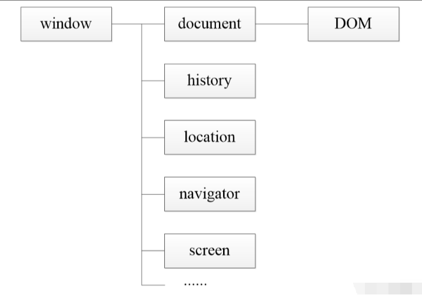
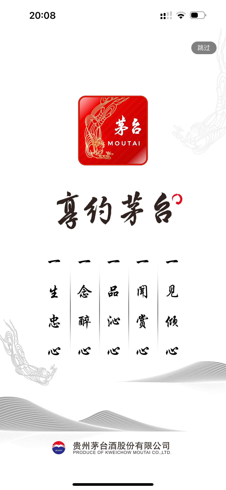

# day16_Harmony生态中的BOM对象

BOM : Browser Object Model 浏览器对象模型 , 他主要里面包含了对浏览器的一系列的操作 , 比如 弹窗, 跳转, 刷新等等; 



## 今日学习目标 : 

1. 定时器函数 
2. location对象
3. history对象
4. 综合案例

## 1. 定时器函数

### 1) 一次性定时器

​	 一次性定时器，执行一次后，自动取消，也可以在延时之前，取消定时器

```javascript
function fun() {
    console.log("定时器")
}
setTimeout(fun, 1000);
```

### 3) 周期性定时器

​	周期性定时器，只要不主动清除定时器，就会一直执行

```javascript
function fun() {
    console.log("定时器")
}
setInterval(fun, 1000);
```

### 4) 清除定时器

​	定时器也是占内存的 , 如果程序结束 , 定时器始终占内存空间 , 为了避免内存空间被占用, 所以再程序运行结束后, 我们需要清空定时器

#### 1) 清空一次性定时器

```javascript
var timeFun = setTimeout(function () {
    console.log("定时器")
}, 1000);
clearTimeout(timeFun)
```

#### 2) 清空周期性定时器

```javascript
var timeFun = setInterval(function () {
    console.log("定时器")
}, 1000);
clearInterval(timeFun)
```

## 2. 定时案例

1. 60秒倒计时按钮 ( 不用获取本地时间, 直接使用变量60定时递减即可 )
2. 各网站右下角的聊天广告窗口 ( 点击关闭窗口之后, 三秒钟继续弹出 )

​	

1. App10秒关闭窗口并跳转到首页 ( 需要结合BOM知识点 / 抖音 / 各种app广告倒计时结束跳转到 主页 )

   

## 3. location对象

BOM对象中保存了很多浏览器的相关方法和属性, 为我们提供很多方便

### 1) location.href

作用1 : 直接使用打印 , 或者是赋值给一个变量 , 就直接能获取到当前页面中地址栏中的相关地址信息

```javascript
var str1 = location.href
console.log(str1)
```

作用2 : 如果location.href被赋值 , 则代表的是 , 跳转到对应的网站地址

```javascript
location.href="https://www.baidu.com"
```

作用3 : 如果location.href被复制的时候 , 后面跟参数 , 切记一定要使用?进行分隔 , 后面跟对应的参数     

```javascript
location.href="https://www.baidu.com?user=liming&upwd=999999"
```

### 2) 案例

1. (index1.html)页面中有一个输入框 ,  一个按钮 , 点击按钮的时候 , 跳转到 

## 4. History对象

history对象中 保存了浏览器中的历史记录的相关信息, 可以完成历史记录的完整案例

以下为history对象 , 使用历史记录的前提需要; 

| 方法      | 描述                              |
| --------- | --------------------------------- |
| back()    | 加载 history 列表中的前一个 URL   |
| forward() | 加载 history 列表中的下一个 URL   |
| go()      | 加载 history 列表中的某个具体页面 |

### 1) back / forward / go方法

back()方法的本质含义, 返回, 返回到上一个/前一个URL地址 ; 前提是必须得有历史记录, 没有历史记录的时候是不能完成的;

forward()方法的本质含义,前进,前进到下一个/后一个URL地址 ; 前提是必须得有历史记录, 没有历史记录的时候是不能完成的;

go()方法, 指的是, 铜鼓历史记录的长度跳转到对应的页面中去, 

### 2) 案例 实现a、b、c页面之间前进后退和跳转。

页面1  index1.html  ;

```html
<script type="text/javascript">
    function func(){
        history.forward();
    }
    function func1(){
        history.go(2);
    }
</script>
<body >
    <a href = "b.html">b.html</a>
    <input type="button" value="前进" onclick="func()" />
    <input type="button" value="go到c" onclick="func1()" />
</body>

```

页面2   index2.html ;

```html
<script type="text/javascript">

    function func(){
        history.forward();
    }
    function func1(){
        history.back();
    }
</script>
<body >
    <a href = "c.html">c.html</a>
    <input type="button" value="前进" onclick="func()" />
    <input type="button" value="后退" onclick="func1()" />
</body>

```

页面3   index3.html ;

```html
<script type="text/javascript">
<!--
    function func1(){
        history.back();
    }
    function func(){
        history.forward();
    }
//以当前页为0，往前的为负数。
    function func2(){
        history.go(-1);
    }
//-->
</script>
 <body >
    <input type="button" value="前进" onclick="func()" />
    <input type="button" value="后退" onclick="func1()" />
    <input type="button" value="go到b" onclick="func2()" />
 </body>
```

备注 : ***先打开a页面，通过超链进入b页面，再通过超链进入c页面，然后就可以在abc页面之间随意跳转了。\***