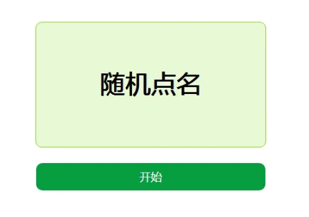
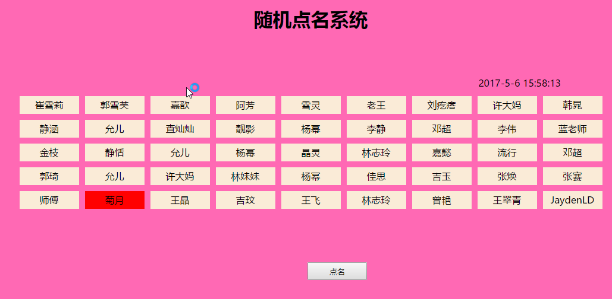

# day17_鸿蒙生态中的DOM对象

背景 : 再HarmonyOS生态中网站开发的过程中 , 除了能实现页面中的跳转, 还要能实现网站中的数据操作, 本节课我们我们主要完成的是页面中的DOM操作案例

## 今日学习目标

1. 什么是DOM
2. 如何获取页面中的DOM
3. 如果和获取DOM元素中的值
4. 如何向DOM元素中添加内容
5. 案例
6. 案例
7. 案例

## 1. 什么是DOM

DOM 是document Object Model 的简写 ; 在这里DOM其实就是页面中的一切元素 , 有可能是隐藏元素, 有可能按钮, 有可能是其他标签等等

## 2. 如何获取页面中的DOM呢

获取页面元素的方法其实有很多, 但是实际开发的过程中, 我们应用频率最高的是下面的两种; querySelector和querySelectorAll

### 1) querySelector：

​	通过CSS选择器获取元素。这个方法返回匹配指定选择器的第一个元素。 

### 2) querySelectorAll：

​	通过CSS选择器获取元素。这个方法返回匹配指定选择器的所有元素 ; 返回的是一个类数组, 如果想要拿到这个类数组中的某一个元素, 则需要通过数组的方法继续访问;

### 3) demo

```html
<div id="box1">
  <p>1</p>
  <p class="para">2</p>
  <p class="para">3</p>
</div>
<script>
  //找到的是多个p标签里面拥有para类名的第一个元素
  var para = document.querySelector("#box1 .para");
  console.log(para); // <p class="para">2</p>

  //返回的是一个类数组
  var paras = document.querySelectorAll("#box1 .para");
  console.log(paras); // NodeList(2) [p.para, p.para]
  cosnole.log(paras[0])
</script>
```

## 3. 如何获取页面元素中的值

页面中的元素可以分为单标签和双标签, 接下来我们就用来来获取标签中的值

### 1) 双标签中的值获取方法

```html
<div class="box1">
	欢迎来到王者荣耀
</div>
<div class="box2">
    <p>
		欢迎来到王者荣耀
    </p>
</div>
<script>
    
	var box1=document.querySelector(".box1")  //获取元素
    var box2=document.querySelector(".box2")  //获取元素
    
    //在这里 元素.innerHTML 能获取页面中的元素
    console.log(box1.innerHTML)  //获取页面元素中的值
    console.log(box2.innerHTML)  //获取页面元素中的值, 再这里如果元素内有折行,文本,其他标签,都会被获取到
</script>
```

```html
<div class="box1">
	欢迎来到王者荣耀
</div>
<div class="box2">
    <p>
		欢迎来到王者荣耀
    </p>
</div>
<script>
    //在这里 元素.innerHTML 能获取页面中的元素
	var box1=document.querySelector(".box1")  //获取元素
    var box2=document.querySelector(".box2")  //获取元素
    
    //如果元素.innerHTML在等号的左侧, 属于被复制的状态, 则是向标签内进行复制
    box2.innerHTML=box1
</script>
```

### 2) 单标签中的值获取方法 ( input )

```html
<input type="text" value="请输入用户名"> <!--value的意思是输入框里面一个值-->
<script>
    var put = document.querySelector("input")
    
    //基本语法 元素.value 是用来专门获取表单元素单标签中的值
    console.log(put.value)
</script>
```

### 3) 案例

案例描述 , 页面中有三个元素, 输入框按钮和p标签, 要求点击按钮的时候, 获取输入框中的姓名, 再p标签显示

```html
<input type="text" placeholder="请输入一个姓名"><button>普通按钮</button>
<p></p>
<script>
	//案例提示
    //1)获取页面中的元素(input,button,p)
    //2)给button按钮绑定单击事件
    //3)再事件函数中获取输入框中的值; 
    //4)将获取的值赋值给p标签
</script>
```

## 4. 如何通过js修饰元素

### 1) 修饰页面元素

```html
<div></div>
<script>
	var box = document.querySelector("div")
    
    //基本语法
    //元素.style.CSS属性
    //注意的是: 如果你的CSS属性为单一属性, 例如,background-color等等,这样的属性, 我们书写的时候,需要改成驼峰命名法
    //注意的是: 我们这种语法是通过CSS的行内样式进行修饰的
    box.style.width="200px"
    box.style.height="200px"
    box.style.backgroundColor="blue"
</script>
```

### 2) 案例

案例描述 : 页面中有一个空的div, 点击按钮的时候, 修改前面div背景颜色; 

### 3) 案例进阶

案例描述 : 页面中有一个空的div 每点击一次按钮, 就能改变div的颜色

案例提示 : 需要使用随机数,生成一个随机数, 和字符串的拼接 Math.floor(Math.random()*256) ; 背景颜色使用rgba()将三个随机数拼接进来

### 4) 案例



随机点名 , 给定一个数组 , 里面放置班级里面的对应同学的名字 , 例如 : arr=["小张","小王","小赵","小刘","小李","小汪"] , 随机点名区域不用自动切换, 要求点击一次按钮, 随机上去一个名字

案例提示 : 随机数当做数组的下标

### 5) 修改标签属性

```html
<!--通过改变标签属性的值来改变元素-->
<style>
    .box1{
     	background-color:red;
        width:200px;
        height:80px;
    }
    #bobo{
        width:500px;
        height:100px;
        background-color:green
    }
</style>
<div></div>
<p></p>
<script>
	var box = document.querySelector("div")
    var bobo = document.querySelector("p")
    
    //如果想要通过class类名修饰一个元素
    // 基本语法 : 元素.className
    box.className="box1"
    //如果想要通过id名修饰一个元素
    // 基本语法 : 元素.id
    bobo.id="bobo"
</script>
```

### 6) 案例

案例描述 : 页面中有一个盒子, 盒子里面有一张图片, 是灰色的点灯图; 盒子下面有两个按钮一个开灯一个关灯  ; 默认情况下开灯可以使用, 关灯按钮是禁用的; 

点击开灯按钮的时候, 开灯按钮被禁用掉, 关灯按钮解除禁用, 依次类推;  

同时点击灯泡的时候能实现 : 暗-亮-暗-亮 情况

详见素材

### 7) 案例

案例描述 : 完成WiFi密码的明密文的切换 ; 页面中一个输入框, 输入框上面有一个on/off的开关, 默认情况下密码是不能显示的;  开关按钮显示的为off; 点击开关按钮的时候, off变成on, 同时密码能正常显示;  再次点击on则变成off同时继续密文显示;

### 8) 案例

完成随机点名表 : 使用到的知识点, 定时器, 随机数, 数组等等;




